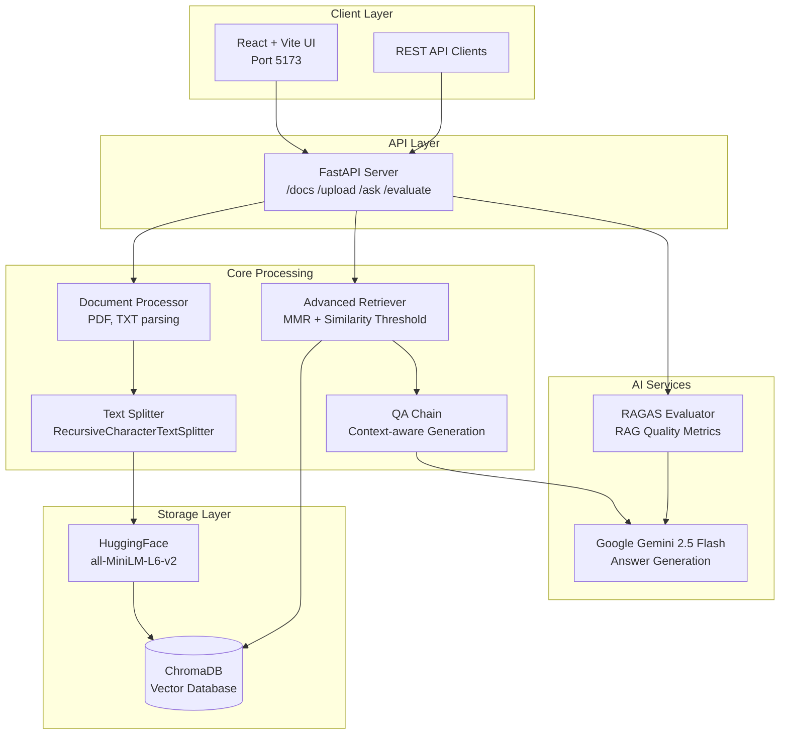

# IntelliDoc AI


A production-ready **Retrieval-Augmented Generation (RAG)** system for intelligent document question-answering. Upload PDFs or text files, ask natural-language questions, and get grounded answers with source attribution — backed by Google Gemini and ChromaDB.

---

## Architecture



---

## Features

- **Multi-format ingestion** — PDF and TXT with intelligent chunking (1 000 chars / 200 overlap)
- **Semantic search** — HuggingFace `all-MiniLM-L6-v2` embeddings stored in ChromaDB
- **Grounded answers** — Gemini 2.5 Flash generates answers strictly from retrieved context
- **Source attribution** — every answer cites the document chunks it used
- **Quality evaluation** — RAGAS metrics: faithfulness and answer relevancy
- **React frontend** — React + Vite SPA with drag-and-drop upload, chat Q&A, and RAGAS evaluation dashboard
- **Docker-ready** — single `docker-compose up` spins up both services

---

## Tech Stack

| Component  | Technology                   |
| ---------- | ---------------------------- |
| LLM        | Google Gemini 2.5 Flash      |
| Embeddings | HuggingFace all-MiniLM-L6-v2 |
| Vector DB  | ChromaDB (persistent)        |
| Frontend   | React + Vite + Tailwind CSS  |
| REST API   | FastAPI + Uvicorn            |
| Evaluation | RAGAS + Gemini               |
| Testing    | pytest (22 tests)            |
| Linting    | ruff                         |

---

## Quick Start

### 1. Clone & install

```bash
git clone https://github.com/shiva-s936/IntelliDoc-AI.git
cd IntelliDoc-AI
pip install -r requirements.txt
```

### 2. Configure environment

```bash
cp .env.example .env
# Edit .env and add your GEMINI_API_KEY
```

### 3. Run

```bash
# FastAPI backend
make run-api         # → http://localhost:8000/docs

# React frontend (separate terminal)
make run-ui          # → http://localhost:5173
```

### 4. Docker (optional)

```bash
docker-compose up --build
```

---

## REST API

| Method     | Endpoint              | Description                            |
| ---------- | --------------------- | -------------------------------------- |
| `GET`      | `/health`             | System health & document count         |
| `POST`     | `/documents/upload`   | Upload and index a PDF or TXT file     |
| `GET`      | `/documents/list`     | List all indexed document filenames    |
| `GET`      | `/documents/info`     | Collection statistics                  |
| `DELETE`   | `/documents/clear`    | Reset the vector store                 |
| `POST`     | `/questions/ask`      | Ask a question and get an answer       |
| `POST`     | `/evaluation/run`     | Run RAGAS quality evaluation           |

Interactive docs available at **`/docs`** (Swagger) and **`/redoc`**.

---

## Project Structure

```text
IntelliDoc-AI/
├── api.py                      # FastAPI REST API
├── utils/
│   ├── config.py               # Environment-based configuration
│   ├── document_processor.py   # PDF/TXT loading and chunking
│   ├── vector_store.py         # ChromaDB operations
│   ├── retriever.py            # MMR retrieval + similarity filtering
│   ├── qa_chain.py             # Gemini LLM integration
│   └── evaluation.py           # RAGAS evaluation framework
├── frontend/                   # React + Vite + Tailwind CSS
│   └── src/
│       ├── App.jsx
│       ├── api.js
│       └── components/         # Upload, QA, Evaluation, Sidebar
├── tests/                      # pytest test suite (22 tests)
├── Dockerfile
├── docker-compose.yml
├── Makefile
└── .github/workflows/ci.yml    # GitHub Actions CI
```

---

## Development

```bash
make test      # Run all 22 tests
make lint      # Ruff linter
make format    # Ruff formatter
```

---

## Evaluation Metrics (RAGAS)

Evaluation is powered by [RAGAS](https://docs.ragas.io) using Google Gemini as the judge LLM. No ground-truth labels are required.

| Metric               | Description                                    |
| -------------------- | ---------------------------------------------- |
| **Faithfulness**     | Fraction of answer claims supported by context |
| **Answer Relevancy** | How directly the answer addresses the question |

---

## Use Cases

- Enterprise knowledge management and internal documentation search
- Customer support automation from product documentation
- Research paper and report analysis
- Legal document review and compliance checking

---

*Built with LangChain, ChromaDB, Google Gemini, React, FastAPI, and RAGAS.*
