# IntelliDoc-AI Architecture Diagrams

## System Architecture

```mermaid
flowchart TB
    subgraph Client["🖥️ Client Layer"]
        UI["Streamlit Web UI"]
        API_Client["REST API Clients"]
    end

    subgraph API["🔌 API Layer"]
        Streamlit["Streamlit Server<br/>Port 5000"]
        FastAPI["FastAPI Server<br/>/docs /upload /ask /evaluate"]
    end

    subgraph Core["⚙️ Core Processing"]
        DP["Document Processor<br/>PDF, TXT parsing"]
        Chunker["Text Splitter<br/>RecursiveCharacterTextSplitter"]
        Retriever["Advanced Retriever<br/>Semantic Search + Compression"]
        QA["QA Chain<br/>Context-aware Generation"]
    end

    subgraph Storage["💾 Storage Layer"]
        ChromaDB[("ChromaDB<br/>Vector Database")]
        Embeddings["HuggingFace<br/>Embeddings"]
    end

    subgraph AI["🤖 AI Services"]
        Gemini["Google Gemini 2.5 Flash<br/>Answer Generation"]
        TruLens["TruLens Evaluator<br/>RAG Quality Metrics"]
    end

    UI --> Streamlit
    API_Client --> FastAPI
    
    Streamlit --> DP
    FastAPI --> DP
    
    DP --> Chunker
    Chunker --> Embeddings
    Embeddings --> ChromaDB
    
    Streamlit --> Retriever
    FastAPI --> Retriever
    
    Retriever --> ChromaDB
    Retriever --> QA
    QA --> Gemini
    
    QA --> TruLens
    
    style Client fill:#e1f5fe
    style API fill:#f3e5f5
    style Core fill:#e8f5e9
    style Storage fill:#fff3e0
    style AI fill:#fce4ec
```

## Data Flow - Document Processing

```mermaid
flowchart LR
    subgraph Input["📄 Input"]
        PDF["PDF Files"]
        TXT["Text Files"]
    end

    subgraph Process["⚙️ Processing"]
        Parse["Parse Document"]
        Extract["Extract Text"]
        Chunk["Chunk Text<br/>1000 chars / 200 overlap"]
        Embed["Generate Embeddings"]
    end

    subgraph Store["💾 Storage"]
        Vector[("ChromaDB<br/>Persistent Storage")]
    end

    PDF --> Parse
    TXT --> Parse
    Parse --> Extract
    Extract --> Chunk
    Chunk --> Embed
    Embed --> Vector

    style Input fill:#e3f2fd
    style Process fill:#f1f8e9
    style Store fill:#fff8e1
```

## Q&A Flow

## Component Architecture

```mermaid
graph TB
    subgraph Utils["📦 utils/"]
        config["config.py<br/>Environment & Settings"]
        doc_proc["document_processor.py<br/>File Loading & Chunking"]
        vec_store["vector_store.py<br/>ChromaDB Operations"]
        retriever["retriever.py<br/>Advanced Retrieval"]
        qa_chain["qa_chain.py<br/>LLM Integration"]
        evaluation["evaluation.py<br/>TruLens Metrics"]
    end

    subgraph Apps["🚀 Applications"]
        app["app.py<br/>Streamlit UI"]
        api["api.py<br/>FastAPI REST"]
    end

    app --> config
    api --> config
    app --> doc_proc
    api --> doc_proc
    doc_proc --> vec_store
    app --> retriever
    api --> retriever
    retriever --> vec_store
    retriever --> qa_chain
    qa_chain --> evaluation

    style Utils fill:#e8eaf6
    style Apps fill:#e0f2f1
```

## Evaluation Metrics

---

*Diagrams created with Mermaid.js - View in any Markdown renderer with Mermaid support*
